## Introduction
This web application is a domain search engine providing features of web crawling, keyword searching, and word suggestions. 

## Demo
Click on the thumbnail to play the demo on Youtube

[](https://www.youtube.com/watch?v=jPoD_kT1rh4)


## Architecture
The frontend server is developed by Vue, Router, and Vuex, the backend is built by Java Spring Boot Restful API, and it is deployed in AWS EC2.

Web crawling feature is implemented by using JSoup, StringTokenizer, Regex, Recursion, TST, and InvertedIndex; Keyword searching, including the pagination and caching, is implemented via Heap select and separate chaining; Word suggestions are developed via Edit distance, heap select, and quick sort.


## User manual
Step 1: crawl urls recursively from an input domain. As the application is deployed on AWS EC2, input its public ip and the default port in browser. Assume you are the administrator. Click on the “Domain settings” tab on the sidebar, and input the three attributes to crawl the urls: Domain where you want your search conducted in, Depth from the main page also the entry point of the domain, and the Amount of the urls you want to retrieve to build up your search pool.

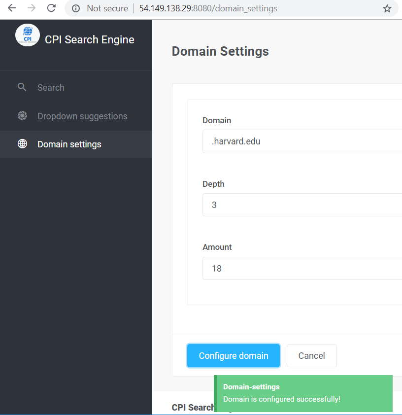

Backend output

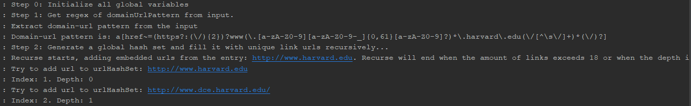
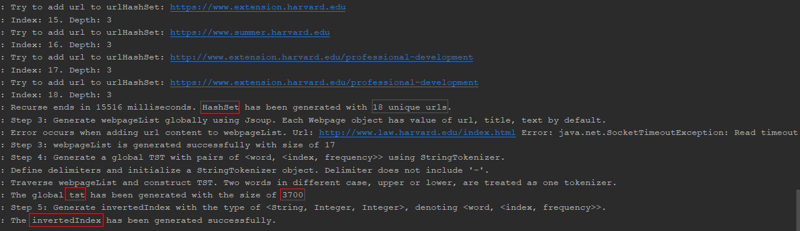

Source code fragments

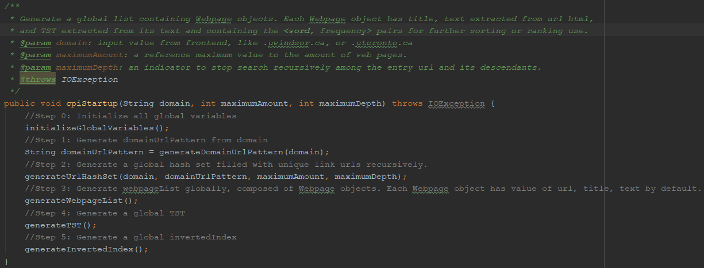
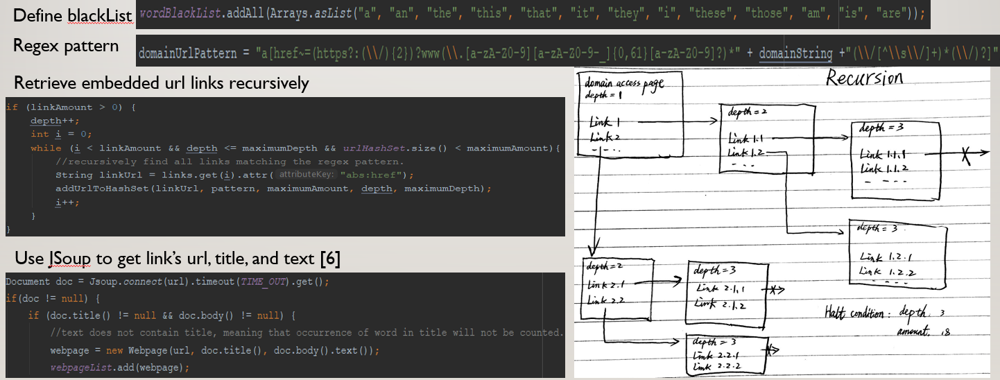
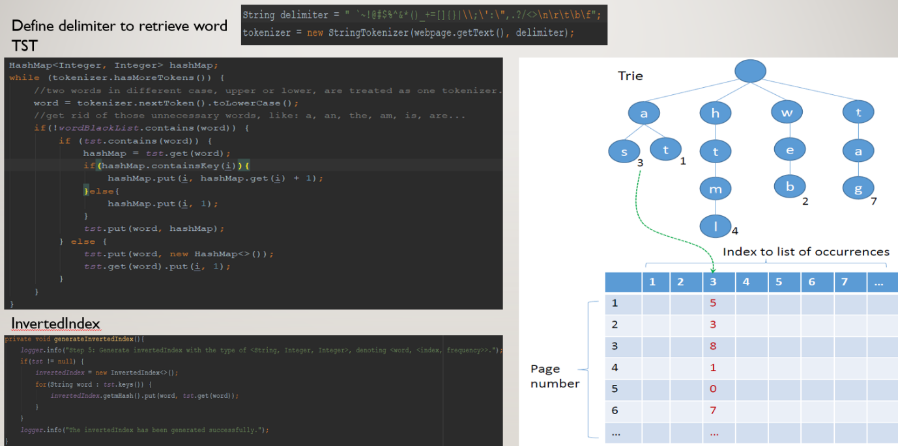

Step 2: Keyword searching. Click the “Search” tab on the sidebar and input a keyword to start searching. Web page containing that keyword will be retrieved and listed in the decreasing order of its frequency. Result with web page quantity greater than 5 will be shown in pagination.


use the pagination bar to navigate

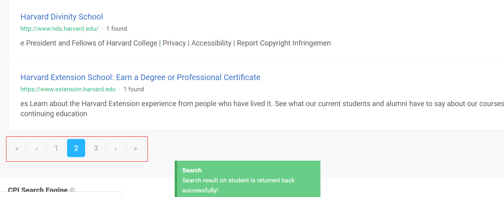

Go back to the first page, you will see that the process time is shortened significantly by under caching.


Step 3：Search a keyword that does not exist, you will get suggestions when there are some words whose edit distance from the input is 1 or 2. Clicking on any suggested keyword in a blue tag shows the search result of it directly.

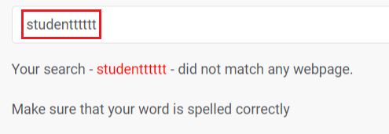
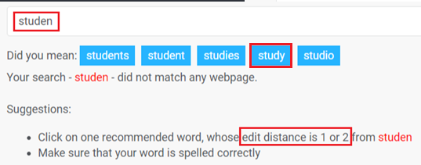


Step 4: Click on “Dropdown suggestions” and input a keyword, you will see a prefix-based suggestion list in the order to the descending order of their frequency. The dropdown list appears when the length of the input string is larger than 3, shows 5 labels maximumly, and is subject to change according to the input.


Backend log

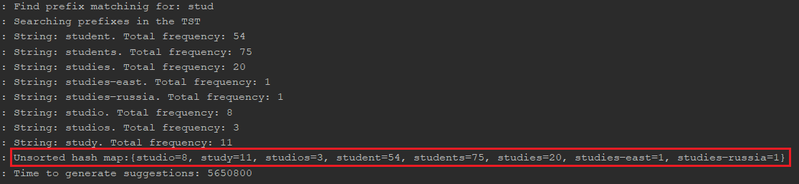

## Deployment: 
Change the dataUrl in the main.js file to deploy the application locally or on AWS EC2:

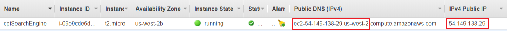

Step 1: frontend server
```
Git clone https://github.com/hongshuidang/cpiSearchEngine_frontend.git
```
```
npm install
```
```
npm install node-sass
```
```
npm run serve
```

Step 2: backend server
```
Git clone https://github.com/hongshuidang/cpiSearchEngine_backend.git
```
Run in intellij via the embedded tomcat in Spring boot project, or generate a war package and put it into provided tomcat server.

